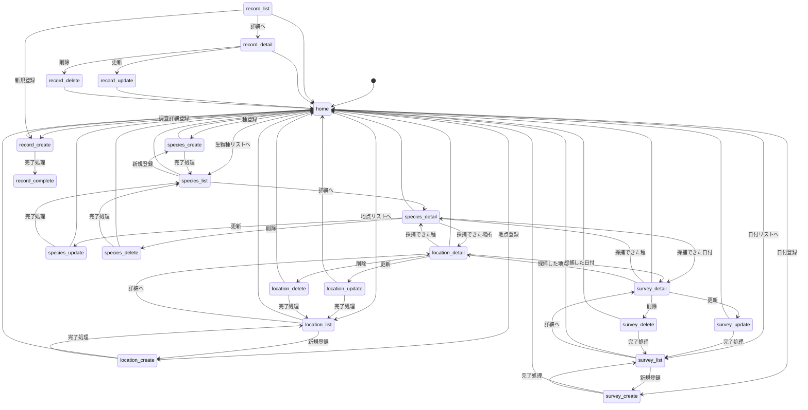

```mermaid
stateDiagram
[*] --> home
home --> species_create: 種登録
home --> location_create: 地点登録
home --> survey_create: 日付登録
home --> record_create: 調査詳細登録
home --> species_list: 生物種リストへ
home --> location_list: 地点リストへ
home --> survey_list: 日付リストへ

species_create --> home
species_create --> species_list: 完了処理

location_create --> home
location_create --> location_list: 完了処理

survey_create --> home
survey_create --> survey_list: 完了処理

record_create --> home
record_create --> record_complete: 完了処理

species_list --> home
species_list --> species_create: 新規登録
species_list --> species_detail: 詳細へ

location_list --> home
location_list --> location_create: 新規登録
location_list --> location_detail: 詳細へ

survey_list --> home
survey_list --> survey_create: 新規登録
survey_list --> survey_detail: 詳細へ

record_list --> home
record_list --> record_create: 新規登録
record_list --> record_detail: 詳細へ

species_detail --> home
species_detail --> species_update: 更新
species_detail --> species_delete: 削除
species_detail --> location_detail: 採捕できた場所
species_detail --> survey_detail: 採捕できた日付


location_detail --> home
location_detail --> location_update: 更新
location_detail --> location_delete: 削除
location_detail --> species_detail: 採捕できた種
location_detail --> survey_detail: 採捕した日付

survey_detail --> home
survey_detail --> survey_update: 更新
survey_detail --> survey_delete: 削除
survey_detail --> species_detail: 採捕できた種
survey_detail --> location_detail: 採捕した地点

record_detail --> home
record_detail --> record_update: 更新
record_detail --> record_delete: 削除


species_update --> home
species_update --> species_list: 完了処理

species_delete --> home
species_delete --> species_list: 完了処理

location_update --> home
location_update --> location_list: 完了処理

location_delete --> home
location_delete --> location_list: 完了処理

survey_update --> home
survey_update --> survey_list: 完了処理

survey_delete --> home
survey_delete --> survey_list: 完了処理

record_update --> home

record_delete --> home
```