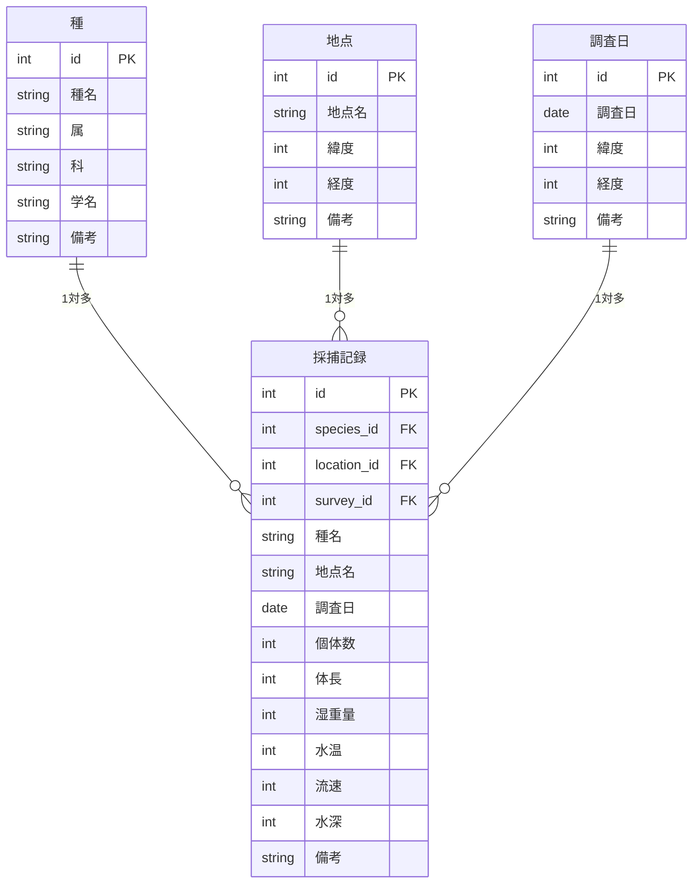

<!-- crud_diagram.md -->

```mermaid
erDiagram
    種 {
        int id PK
        string 種名
        string 属
        string 科
        string 学名
        string 備考
    }
    地点 {
        int id PK
        string 地点名
        int 緯度
        int 経度
        string 備考 
    }
    調査日 {
        int id PK
        date 調査日
        int 緯度
        int 経度
        string 備考 
    }
    採捕記録 {
        int id PK
        int species_id FK
        int location_id FK
        int survey_id FK
        string 種名
        string 地点名
        date 調査日
        int 個体数
        int 体長
        int 湿重量
        int 水温
        int 流速
        int 水深
        string 備考
    }

    種 ||--o{ 採捕記録 : "1対多"
    地点 ||--o{ 採捕記録 : "1対多"
    調査日   ||--o{ 採捕記録 : "1対多"
```